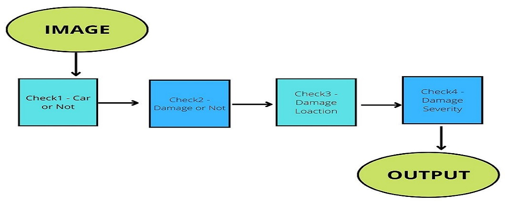
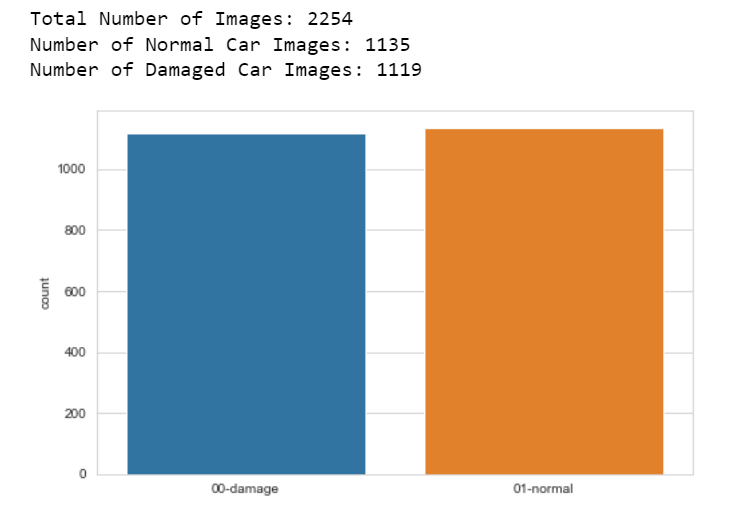
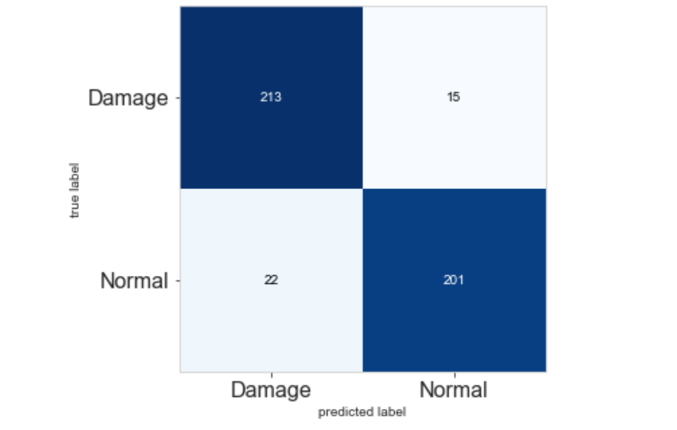

# Car Damage Inspection using Deep Learning
## Objective
To accurately classify damaged vehicles in order to facilitate car insurance claims, using computer vision and deep learning.
## Business Problem
Whenever something bad(damage) happens to our car, the first action most of us take is to call our insurance company and tell them what has happened. 
We then have to wait for an agent from the insurance company to come and inspect the car physically, which usually involves taking pictures of the damaged areas. 
The agent then forwards his/her findings to the insurance company for processing. 
This process of inspection usually takes weeks and sometimes months, which results in claim delay.
## Linking Problem to Deep Learning
With the power of deep learning, we can utilize Convolution Neural Network(CNN) achitecture along with transfer learning to help speed up the process of car inspection. 
Convolution neural network allows us to be able to build a model that accepts image as input data, learn from the image and outputs a predicted label/category which the image belongs. 
With this, we can build a system that allow users to submit image of thier damaged car, passes the image through multiple checks and give report on the location of the damage and how severe the damage is. 
The system will be able to predict if the location of the damage is on the front, rare or side of the car and if the damage is minor, moderate or severe. 
This type of system will enable insurance companies to receive quick report on a customers situation, thereby speeding the the process of insurance claim.

**Transfer Learning - VGG16**

Building a Convolution Neural Network model from scratch usually requires high system hardware configuration and a very large training data set. 
Transfer learning allows us to be able to make use of the weights of already trained models. 
VGG16 is a convolution neural network architecture that has been trained to classify images of 1000 different labels/categories including cars, with 92.7% accuracy. 
For this project, we will be using the VGG16 to detect images(car or not) and to extract features, which will be used to build different classification models.

## Model Architecture and  Pipline

1. User submit image.
2. First Check - checks if image is of a car or not(using VGG16).
3. Second Check - checks if car is damaged or not(VGG16 for feature extraction, Logistic Regression for building classification model)
4. Third Check - checks for the location of damage(VGG16 for feature extraction, Random Forest for building classification model)
5. Fourth Check - checks for the severity of damage(VGG16 for feature extraction, Random Forest for building classification model)

## Tech Stack and Tools Used
**Data Collection**

- Bing image downloader - Online image data scraper
- [Stanford car image dataset](https://www.kaggle.com/datasets/jessicali9530/stanford-cars-dataset)
- [Kaggle]( https://www.kaggle.com/anujms/car-damage-detection )

**Model Developement**

- Tensorflow - Deep learning library
- Keras - Deep learning library
- Numpy - Scientific numerical calculation library
- Scikit learn - Machine learning library

**Web Development**

- Django - Python web framework
- Bootstrap - HTML, CSS and Javascript framework
- Ajax - Javascript framework

## Quick glance at Analysis

Confusion Matrix

Accuracy: 0.91

## Explore Jupyter Notebook
Explore jupyter notebook here

## Limitations

## Improvement

## Run Locally

## Demo
